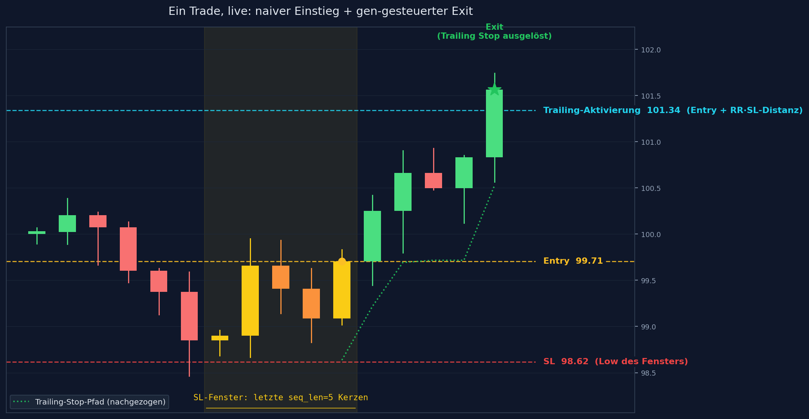
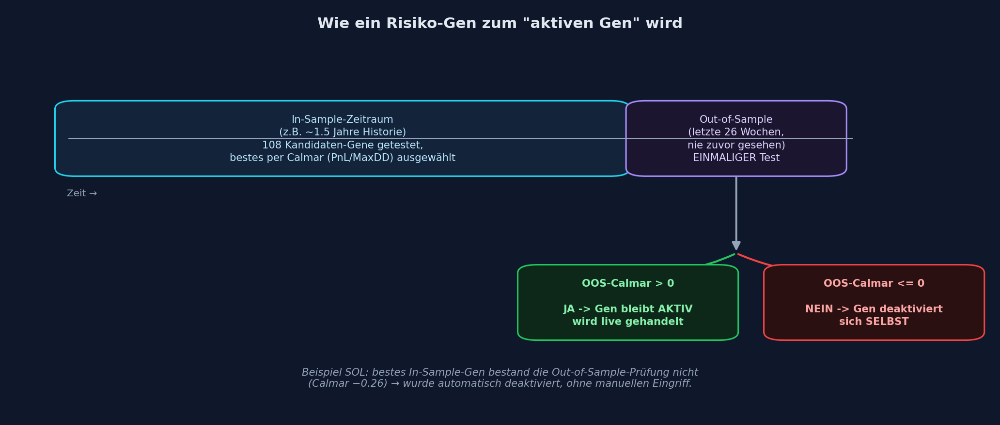

# dnabot — Adaptive Risk-Genome System

Ein selbstlernender Trading-Bot, der über eine **lebende, selbstlernende
Risiko-/Exit-Gen-Datenbank** handelt (`momentum_exit`-Strategie). Entry,
Trailing-Stop, Self-Learning und Telegram-Benachrichtigungen laufen über eine
gemeinsame Live-Infrastruktur.

> **Disclaimer:** Diese Software ist experimentell und dient ausschließlich Forschungszwecken.
> Der Handel mit Kryptowährungen birgt erhebliche finanzielle Risiken. Nutzung auf eigene Gefahr.
> Backtest-Ergebnisse (auch die unten gezeigten) sind keine Garantie für zukünftige Performance.

---

## Grundidee

**Kurzfassung:** Der Bot versucht nicht vorherzusagen, ob der Kurs steigt
oder fällt. Er folgt einfach der Kerze. Der eigentliche Trick steckt
komplett im Ausstieg: ein enges, cleveres Stop-Loss/Trailing-Setup, das
Verlierer schnell abschneidet und Gewinner laufen lässt — und dieses Setup
wird pro Coin/Timeframe automatisch getestet und laufend weiterlernt, genau
wie bei einem lebenden Organismus, der Gene weitervererbt, die sich bewährt
haben.

Der Einstieg selbst hat also **keinen Vorhersage-Anspruch**: der Bot steigt
schlicht in Richtung der letzten Kerze ein (steigt sie, geht er long; fällt
sie, geht er short). Der ganze Vorteil steckt im Ausstieg, in drei
Stellschrauben:

- **SL-Fenster:** wie viele der letzten Kerzen bestimmen den Stop-Loss
- **Risk/Reward-Ratio:** wie weit der Kurs laufen muss, bevor der Trailing-Stop aktiviert wird
- **Trailing-Callback:** wie eng der Gewinn nachgezogen wird

So sieht das an einem einzelnen Trade aus:



### Ein "Gen" ist eine Risiko-Einstellung

Ein "Gen" ist hier eine Risiko-Kombination (`seq_len`, `rr_ratio`,
`trailing_pct`, `risk_pct`) — sie steht dafür, dass dieses SL/Trailing-Setup
für genau dieses Pair/Timeframe profitabel ist. Bewertet wird per
Calmar-Ratio (PnL im Verhältnis zum Drawdown), nicht per Trefferquote.

Damit ein Gen überhaupt live gehandelt wird, muss es zwei Hürden nehmen:
zuerst gegen 100+ andere Kandidaten auf historischen Daten gewinnen, dann
sich auf einem Zeitraum bestätigen, den es beim Auswählen noch nie gesehen
hat. Erst danach gilt es als "aktiv":



Der Bot handelt also jede Kerze — aber immer nur mit den Risiko-Parametern,
die sich für genau dieses Pair und diesen Timeframe echt bewährt haben. Kein
aktives Gen für ein Pair → kein Trade, statt mit ungetesteten
Default-Werten zu raten.

---

## Architektur

```
dnabot/
├── run_pipeline.sh                # Interaktive Pipeline: Discovery → Backtest → Report
│                                     Plattformübergreifend (Windows .venv/Scripts UND Unix .venv/bin)
├── risk_genome_discover.py        # Discovery: Kandidaten-Gene erzeugen, IS/OOS-getrennt
│                                     bewerten, bestes Gen aktivieren (echte simulate_trade())
├── backtest_momentum_exit.py      # Backtest ueber die ECHTE Live-Signalfunktion gegen
│                                     frische Bitget-Daten (kein Nachbau)
├── run_momentum_exit_pipeline.sh  # Liest active_strategies, backtestet jedes Pair + Fee-Report
├── run_manual_portfolio_momentum_exit.py    # Manuelle Portfolio-Simulation (Pair-Auswahl,
│                                     gemeinsamer Kapital-Pool, Excel+HTML-Export)
├── run_portfolio_optimizer_momentum_exit.py # Automatische Portfolio-Optimierung (Greedy-
│                                     Calmar-Suche, --auto-write fuer settings.json)
├── show_results.sh                # 5 Analyse-Modi: Einzel-Backtest, manuelle/automatische
│                                     Portfolio-Optimierung, Risiko-Gen-Bibliothek, Charts
├── run_analysis.sh                # 4 Modi: Walk-Forward-Lookback, Monte-Carlo,
│                                     Tageszeit-Analyse, Regime-Performance
├── master_runner.py               # Cronjob-Orchestrator fuer Live-Trading
├── auto_optimizer_scheduler.py    # Automatischer Wochentimer: Discovery -> Backtest aller
│                                     entdeckten Paare -> Portfolio-Optimierung (--auto-write)
├── install.sh                     # Erstinstallation auf VPS
├── update.sh                      # Git-Update (sichert secret.json UND settings.json --
│                                     Live-Config wird NICHT durch Git ueberschrieben, siehe unten)
├── run_tests.sh                   # Pytest-Sicherheitscheck
├── pytest.ini                     # Scope: nur tests/ (recherche/ enthaelt keine echten Tests)
├── settings.json                  # Konfiguration
├── secret.json                    # API-Keys (nicht in Git)
│
└── src/dnabot/
    ├── genome/
    │   ├── risk_genome_db.py      # SQLite-DB fuer Risiko-/Exit-Gene
    │   │                            (artifacts/db/risk_genome.db)
    │   └── risk_evolver.py        # aktiviert das Gen mit dem hoechsten Calmar-Ratio
    │
    ├── strategy/
    │   ├── momentum_exit_logic.py # Momentum-Einstieg (kein Vorhersage-Anspruch),
    │   │                            liest live das aktive Risiko-Gen aus risk_genome_db
    │   └── run.py                 # Entry Point fuer eine Pair/Timeframe-Strategie
    │
    ├── analysis/
    │   └── backtester.py          # simulate_trade() -- identisch in Live UND Backtest
    │                                (siehe feedback_live_backtest_must_match)
    │
    └── utils/
        ├── exchange.py            # Bitget CCXT Wrapper
        ├── trade_manager.py       # Entry/TP/SL + Self-Learning (RiskGenomeDB)
        ├── strategy_overrides.py  # Loest risk_overrides/momentum_exit_overrides auf
        ├── config_loader.py       # Geteiltes settings.json/secret.json-Laden + HISTORY_DAYS_MAP
        ├── telegram.py            # Telegram-Benachrichtigungen
        └── guardian.py            # Crash-Schutz Decorator

analysis/
├── show_risk_genes.py                     # Report: aktive + Kandidaten-Gene pro Pair
├── fee_impact_momentum_exit.py            # Isolierte Gebuehren-/Slippage-Impact-Analyse
├── interactive_chart_momentum_exit.py     # Candlestick-Chart mit Entry/Exit-Markern
├── walkforward_momentum_exit.py           # Rolling Walk-Forward, traegt Lookback in settings.json ein
├── monte_carlo_momentum_exit.py           # Monte-Carlo-Simulation der Trade-Reihenfolge
├── time_analysis_momentum_exit.py         # Performance nach Tageszeit/Wochentag
├── regime_analysis_momentum_exit.py       # Performance nach ADX/ATR-Regime (deskriptiv)
└── momentum_exit_utils.py                 # Geteilte Helper (Laden, Telegram-Versand, Styling)
```

---

## Mechanik

```
Einstieg (KEIN Vorhersage-Anspruch):
  Richtung = eigene Kerzenrichtung der letzten Kerze (Momentum-Fortsetzung)
  KEIN Score-Gate, KEIN Regime-Filter -- jede Kerze wird potenziell gehandelt

Exit (HIER steckt der Edge -- Parameter kommen aus dem AKTIVEN Risiko-Gen,
nicht aus einer festen Konfiguration):
  SL = Low/High der letzten `seq_len` Kerzen (strukturell)
  Trailing-Aktivierung = Entry + rr_ratio × SL-Distanz
  Trailing Stop = trailing_pct nachgezogen, nativ ueber Bitget place_trailing_stop_order
```

Ergebnis-Profil (R-Multiple-Diagnose, siehe Fund AQ in
`research_dnabot_direction_calibration.md`): **viele kleine Verluste, aber
ein Schwanz seltener großer Gewinner** — ein eng nachgezogener Trailing-Stop
lässt eine Position weiterlaufen, solange der Trend hält, und gibt beim
Umkehren nur wenig zurück. Klassisches Trendfolge-Payoff-Profil.

### Risiko-Gen-Datenbank (`risk_genome.db`)

```
src/dnabot/genome/risk_genome_db.py   — SQLite-DB (artifacts/db/risk_genome.db)
                                          Tabellen: risk_genes, risk_gene_occurrences
src/dnabot/genome/risk_evolver.py     — aktiviert das Gen mit dem hoechsten
                                          Calmar (PnL/MaxDD) pro (Pair, Timeframe) --
                                          Selektionskriterium ist Calmar statt
                                          Winrate (bei duennem Edge entscheidet die
                                          Positionsgroesse/der Drawdown ueber
                                          Profitabilitaet, nicht die Trefferquote)
risk_genome_discover.py               — erzeugt Kandidaten-Gene aus einem festen
                                          Parameter-Raster (seq_len x rr_ratio x
                                          trailing_pct x risk_pct), backtestet
                                          jede Kombination mit der ECHTEN
                                          simulate_trade()-Funktion, waehlt via
                                          Evolver das beste Gen NUR auf dem
                                          IS-Anteil, prueft es DANACH einmalig
                                          auf dem echten, nie gesehenen 26-
                                          Wochen-OOS-Anteil -- nur bei
                                          positivem OOS-Calmar bleibt es aktiv
                                          (sonst deaktiviert es sich selbst)
```

`get_momentum_exit_signal(df, params, db)` liest live das **aktive** Gen fuer
das jeweilige Pair/Timeframe aus der DB und nutzt dessen `seq_len`/`rr_ratio`/
`trailing_pct`/`risk_pct` fuer JEDEN Trade. Nach jedem geschlossenen Trade
schreibt `trade_manager.py::self_learn_from_closed_trade()` das Ergebnis
zurueck in `risk_gene_occurrences` (`source='live'`) -- das aktive Gen lernt
laufend aus echten Ergebnissen.

**Kein aktives Gen fuer ein Pair/Timeframe → kein Signal, kein Trade**
(konservativ: kein blindes Handeln mit Default-Werten ohne validierte
Discovery).

### Discovery ausführen und Ergebnisse einsehen

```bash
.venv/bin/python3 risk_genome_discover.py --symbol BTC/USDT:USDT --timeframe 6h
# oder ohne Argumente: alle momentum_exit-Paare aus active_strategies
.venv/bin/python3 risk_genome_discover.py
```

Welches Gen pro Pair/Timeframe gerade aktiv ist (falls vorhanden) und mit
welchem IS-/OOS-Calmar es das geschafft hat, zeigt `./show_results.sh`
(Modus 4) bzw. `analysis/show_risk_genes.py` — die Zahlen ändern sich mit
jedem Discovery-Lauf, deshalb steht hier bewusst keine eingefrorene
Momentaufnahme.

Discovery läuft aktuell über den vollen Pool aus 7 Coins (BTC, XRP, ETH,
SOL, ADA, AAVE, DOGE) × 4 Timeframes (6h, 4h, 2h, 1h) — 1d ist bewusst
ausgeschlossen (zu wenige Kerzen im 26-Wochen-Rolling-Fenster für eine
belastbare Calmar-Schätzung). Für ein Pair/Timeframe ohne aktives Gen wird
schlicht nicht gehandelt, statt mit ungetesteten Default-Werten zu raten.

---

## Konfiguration (`settings.json`)

```json
{
    "live_trading_settings": {
        "active_strategies": [
            { "symbol": "BTC/USDT:USDT", "timeframe": "6h", "strategy_type": "momentum_exit",
              "risk_overrides": { "rr_ratio": 1.5, "risk_per_entry_pct": 1.0, "trailing_callback_rate_pct": 0.5 },
              "momentum_exit_overrides": { "enabled": true, "seq_len": 5 },
              "active": true }
        ]
    },
    "momentum_exit_settings": {
        "enabled": false,
        "seq_len": 5
    },
    "risk_settings": {
        "risk_per_entry_pct": 1.0,
        "leverage": 5,
        "margin_mode": "isolated",
        "rr_ratio": 2.0,
        "trailing_callback_rate_pct": 1.0
    },
    "optimization_settings": {
        "schedule": {
            "day_of_week": 6,
            "hour": 3,
            "minute": 0,
            "interval": { "value": 7, "unit": "days" }
        },
        "backtest_lookback_weeks": 26,
        "start_capital": 1000,
        "max_drawdown_pct": 30,
        "send_telegram_on_completion": true
    }
}
```

| Parameter | Erklärung |
|---|---|
| `active_strategies[].active` | Muss `true` sein, sonst überspringt `master_runner.py` das Pair stillschweigend. |
| `active_strategies[].risk_overrides` | Fallback-Werte, falls (noch) kein aktives Risiko-Gen in der DB existiert. Im Live-Betrieb überschreibt das aktive Gen diese Werte pro Trade. |
| `active_strategies[].momentum_exit_overrides.enabled` | Pro-Strategie-Schalter, überschreibt den globalen `momentum_exit_settings.enabled`-Fallback. |
| `risk_per_entry_pct` | % des Guthabens als Risiko pro Trade (Fallback, siehe oben). |
| `rr_ratio` | Risk-Reward-Ratio — bestimmt Aktivierungspreis des Trailing Stops (Fallback). |
| `trailing_callback_rate_pct` | Trailing Stop Callback in % (Fallback). |
| `optimization_settings.schedule` | Wochentag + Uhrzeit + Intervall für den Auto-Optimizer. |
| `optimization_settings.backtest_lookback_weeks` | Dokumentiert die OOS-Fensterkonvention (26W) — `risk_genome_discover.py::OOS_WEEKS` ist der tatsächliche, hartkodierte Wert. Wird zusätzlich von `run_portfolio_optimizer_momentum_exit.py` gelesen, um `--start-date` herzuleiten. |
| `optimization_settings.start_capital` / `max_drawdown_pct` | Kapitalbasis und Drawdown-Obergrenze für die automatische Portfolio-Auswahl. |

> `strategy_overrides.py` löst `risk_overrides`/`momentum_exit_overrides` pro
> (Symbol, Timeframe) auf — identisch für Live (`run.py`) und Backtest
> (`backtest_momentum_exit.py`), siehe `feedback_live_backtest_must_match`.

---

## Installation 🚀

#### 1. Projekt klonen

```bash
git clone https://github.com/Youra82/dnabot.git
cd dnabot
```

#### 2. Installations-Skript ausführen

```bash
chmod +x install.sh
bash ./install.sh
```

Das Skript erstellt die virtuelle Python-Umgebung, installiert alle Abhängigkeiten und legt die Verzeichnisstruktur an.

#### 3. API-Keys eintragen

```bash
cp secret.json.example secret.json
nano secret.json
```

```json
{
    "dnabot": [
        {
            "name": "Main-Account",
            "apiKey": "DEIN_API_KEY",
            "secret": "DEIN_SECRET",
            "password": "DEIN_PASSPHRASE",
            "telegram_bot_token": "DEIN_BOT_TOKEN",
            "telegram_chat_id": "DEINE_CHAT_ID"
        }
    ]
}
```

---

## Workflow

#### 1. Coins und Timeframes einstellen

```bash
nano settings.json
```

Neuen Eintrag in `active_strategies` anlegen (siehe Konfigurationsbeispiel
oben) — zunaechst mit `"active": false`, bis die Discovery gelaufen ist.

#### 2. Pipeline starten

```bash
./run_pipeline.sh
```

Interaktiv: fragt optional Coins/Timeframes ab (leer = alle
`momentum_exit`-Paare aus `active_strategies`), lässt bei Bedarf die
Risiko-Gen-Datenbank für einen Neustart löschen, und führt dann aus:

1. **Risiko-Gen-Discovery** (`risk_genome_discover.py`) — lädt historische
   Daten, testet das Parameter-Raster, wählt per Calmar das beste Gen im
   In-Sample-Zeitraum und bestätigt es einmalig Out-of-Sample. Nur ein Pair
   mit einem aktiven Gen wird später tatsächlich gehandelt.
2. **Backtest & Gebühren-Check** (`run_momentum_exit_pipeline.sh`, optional)
   — backtestet jedes konfigurierte `momentum_exit`-Pair über die echte
   Live-Signalfunktion gegen frische Bitget-Daten und hängt eine isolierte
   Gebühren-/Slippage-Impact-Analyse an.
3. **Ergebnisse** (`analysis/show_risk_genes.py`) — zeigt pro Pair das
   aktive Gen (falls vorhanden) und die Top-Kandidaten.

Einzeln aufrufbar, z.B. für ein einzelnes neues Pair/Timeframe:

```bash
.venv/bin/python3 risk_genome_discover.py --symbol BTC/USDT:USDT --timeframe 6h
./show_results.sh   # Modus 4: Risiko-Gen-Report
```

#### 3. Strategie live schalten

```bash
nano settings.json
```

```json
{ "symbol": "BTC/USDT:USDT", "timeframe": "6h", "active": true }
```

#### 4. Cronjob einrichten

```bash
crontab -e
```

```cron
*/15 * * * * /usr/bin/flock -n /home/matola/dnabot/dnabot.lock /bin/sh -c "cd /home/matola/dnabot && /home/matola/dnabot/.venv/bin/python3 master_runner.py >> /home/matola/dnabot/logs/cron.log 2>&1"
```

> `master_runner.py` ruft beim Start automatisch `auto_optimizer_scheduler.py`
> auf. Dieser prüft ob eine Risiko-Gen-Discovery fällig ist und führt sie
> dann automatisch aus. Ein separater Cronjob dafür ist **nicht nötig**.

---

## Automatische Wochentimer-Optimierung

```
master_runner.py startet
    ↓
auto_optimizer_scheduler.py prüft: Ist eine Optimierung fällig?
    ├── Nein → sofort beendet (kein Overhead)
    └── Ja →
           1. risk_genome_discover.py     (Risiko-Gene fuer den vollen Pool aus
                                            7 Coins x {6h,4h,2h,1h} neu bewerten,
                                            IS/OOS-gated aktivieren -- nicht nur
                                            die aktuell aktiven Paare)
               ↓
           2. backtest_momentum_exit.py   (jedes Paar mit aktivem Gen ueber die
              (pro entdecktem Paar)        echte Live-Signalfunktion backtesten)
               ↓
           3. run_portfolio_optimizer_momentum_exit.py --auto-write
                                           (Greedy-Calmar-Suche, Max-Drawdown-
                                            limitiert, schreibt active_strategies
                                            NUR bei echter Verbesserung neu,
                                            Excel+HTML-Chart per Telegram)
               ↓
           Telegram: Start + Ende Benachrichtigung
```

1d ist von diesem Pool bewusst ausgeschlossen (zu wenige Kerzen im
26-Wochen-Fenster für eine belastbare Calmar-Schätzung).

Manuell erzwingen:

```bash
.venv/bin/python3 auto_optimizer_scheduler.py --force
```

---

## Tägliche Verwaltung & Wichtige Befehle ⚙️

#### Logs ansehen

```bash
# Live mitverfolgen
tail -f logs/cron.log

# Nach Fehlern suchen
grep -i "ERROR" logs/cron.log

# Auto-Optimizer
tail -f logs/auto_optimizer_trigger.log

# Einzelnes Symbol
tail -n 100 logs/dnabot_BTCUSDTUSDT_6h.log
```

#### Manueller Start (Test)

```bash
cd ~/dnabot && .venv/bin/python3 master_runner.py
```

#### Auto-Optimizer: Status & manueller Start

```bash
# Letzter Discovery-Zeitpunkt
cat ~/dnabot/artifacts/cache/.last_optimization_run

# Optimizer-Log (läuft er? überspringt er? Fehler?)
tail -f ~/dnabot/logs/auto_optimizer_trigger.log

# Discovery sofort erzwingen (ignoriert den Zeitplan)
cd ~/dnabot && .venv/bin/python3 auto_optimizer_scheduler.py --force
```

> **Intervall:** Standardmäßig alle 7 Tage (konfigurierbar in
> `optimization_settings.schedule`).

#### Risiko-Gene aktualisieren, Backtest & Gebühren-Check

```bash
# Interaktive Pipeline (Discovery -> Backtest -> Report), siehe Workflow oben
./run_pipeline.sh

# Risiko-Gen-Discovery einzeln (neu/aktualisieren) -- laeuft automatisch mit
# dem Scheduler (siehe oben), hier fuer manuelles Anstossen/Testen
.venv/bin/python3 risk_genome_discover.py                                        # alle momentum_exit-Paare
.venv/bin/python3 risk_genome_discover.py --symbol ETH/USDT:USDT --timeframe 4h  # neuer Timeframe/Pair

# Report: welches Gen ist aktiv, wie sehen die Top-Kandidaten aus
.venv/bin/python3 analysis/show_risk_genes.py       # oder: ./show_results.sh

# Alle konfigurierten momentum_exit-Strategien backtesten + Fee-Report
./run_momentum_exit_pipeline.sh

# Isolierte Gebühren-Analyse
.venv/bin/python3 analysis/fee_impact_momentum_exit.py --capital 1000 --risk 1.0

# Einzelnes Pair, eigene (noch nicht discovered) Parameter isoliert testen
.venv/bin/python3 backtest_momentum_exit.py --symbol BTC/USDT:USDT --timeframe 6h \
    --capital 1000 --risk 1.0 --rr-ratio 1.5 --trailing-callback-pct 0.5 --seq-len 5 --oos-weeks 26
```

#### Tests ausführen

```bash
./run_tests.sh
```

Führt alle Pytest-Tests aus (Sicherheitscheck vor dem Live-Betrieb).

#### Bot aktualisieren

```bash
./update.sh
```

Sichert automatisch `secret.json` und `settings.json` vor dem `git reset --hard`.

> **Nach dem allerersten Update auf einem VPS (oder wenn `active_strategies`
> im Repo geändert wurde):** `./update.sh` bringt zwar neuen Code, aber
> **nicht** die neuen `active_strategies` — die lokale `settings.json` bleibt
> unangetastet (siehe "Wichtige Regeln" unten). `./run_pipeline.sh` meldet in
> diesem Fall `"Keine momentum_exit-Strategien in active_strategies"`. Fix:
> nur die `active_strategies`-Liste aus dem Repo übernehmen, ohne den Rest
> der lokalen `settings.json` anzurühren:
> ```bash
> cd ~/dnabot
> git show origin/main:settings.json > /tmp/repo_settings.json
> .venv/bin/python3 -c "
> import json
> local = json.load(open('settings.json', encoding='utf-8'))
> repo = json.load(open('/tmp/repo_settings.json', encoding='utf-8'))
> local['live_trading_settings']['active_strategies'] = repo['live_trading_settings']['active_strategies']
> json.dump(local, open('settings.json', 'w', encoding='utf-8'), indent=2, ensure_ascii=False)
> "
> ```
> Die übernommenen Einträge haben ggf. `"active": true` — vor dem nächsten
> Cronjob-Lauf prüfen, ob wirklich schon live gehandelt werden soll, sonst
> vorher auf `"active": false` setzen.

#### Risiko-Gen-Datenbank zurücksetzen

```bash
# Achtung: löscht alle erlernten Risiko-Gene!
rm -f artifacts/db/risk_genome.db*
.venv/bin/python3 risk_genome_discover.py
```

#### Aktives Portfolio löschen

```bash
python3 -c "
import json
s = json.load(open('settings.json', encoding='utf-8'))
s['live_trading_settings']['active_strategies'] = []
json.dump(s, open('settings.json', 'w', encoding='utf-8'), indent=2, ensure_ascii=False)
"
```

---

## Wichtige Regeln

- `secret.json` ist **nicht in Git** — wird von `update.sh` gesichert
- `settings.json` ist **in Git getrackt, wird aber von `update.sh` NICHT überschrieben**
  — vor `git reset --hard` gesichert und danach wiederhergestellt (siehe `update.sh`).
  Das heißt: eine `active_strategies`-Änderung im Repo (z.B. neue momentum_exit-Paare)
  erreicht den VPS **nicht automatisch** über `./update.sh` — muss dort manuell in
  die lokale `settings.json` übernommen werden (Befehl siehe "Bot aktualisieren" oben).
- `artifacts/db/risk_genome.db` ist **nicht in Git** — bleibt nach Updates erhalten
  und enthält das gesamte gelernte Wissen (aktive Gene + Trade-Historie)
- `artifacts/tracker/` ist **nicht in Git** — enthält den offenen Trade-Status pro Symbol
- Immer erst `./run_pipeline.sh` (Discovery + Backtest + Gebühren-Check)
  laufen lassen, bevor ein Pair live geschaltet wird
- Ohne aktives Risiko-Gen für ein Pair/Timeframe wird schlicht nicht gehandelt
  (kein blindes Handeln mit ungetesteten Default-Werten)

---

## Coin & Timeframe Empfehlungen

Der automatische Wochentimer deckt 7 Coins (BTC, XRP, ETH, SOL, ADA, AAVE,
DOGE) × 4 Timeframes (6h, 4h, 2h, 1h) ab; 1d ist strukturell ausgeschlossen
(siehe oben). Was davon tatsächlich live gehandelt wird, entscheidet
`run_portfolio_optimizer_momentum_exit.py` per Calmar-Auswahl — nicht jede
Kombination mit aktivem Gen ist automatisch Teil des Portfolios.

Für einen manuell hinzuzufügenden Coin oder Timeframe außerhalb des
automatischen Pools:

1. `risk_genome_discover.py --symbol ... --timeframe ...` laufen lassen
2. `analysis/show_risk_genes.py` prüfen — gibt es ein aktives Gen, und wie
   sieht dessen OOS-Bestätigung aus (Anzahl Trades, Calmar)?
3. Erst danach `strategy_type: "momentum_exit"` mit `"active": true` in
   `active_strategies` eintragen

Was zählt, sind die tatsächlichen IS/OOS-Zahlen aus `risk_genome_discover.py`
pro Pair — keine qualitativen Einschätzungen ohne Backtest-Beleg.

---

## Abhängigkeiten

```
ccxt==4.3.5      # Exchange-Verbindung (Bitget)
pandas==2.1.3    # Datenverarbeitung
numpy            # Array-Operationen
requests==2.31.0 # Telegram
matplotlib       # Entry-Charts + Fee-Impact-Charts
plotly           # Interaktive Portfolio-Equity-Charts
openpyxl         # Excel-Trade-Export
ta               # ADX/ATR fuer die Regime-Analyse
pytest           # Tests (./run_tests.sh)
sqlite3          # Built-in Python — keine Installation nötig
```
