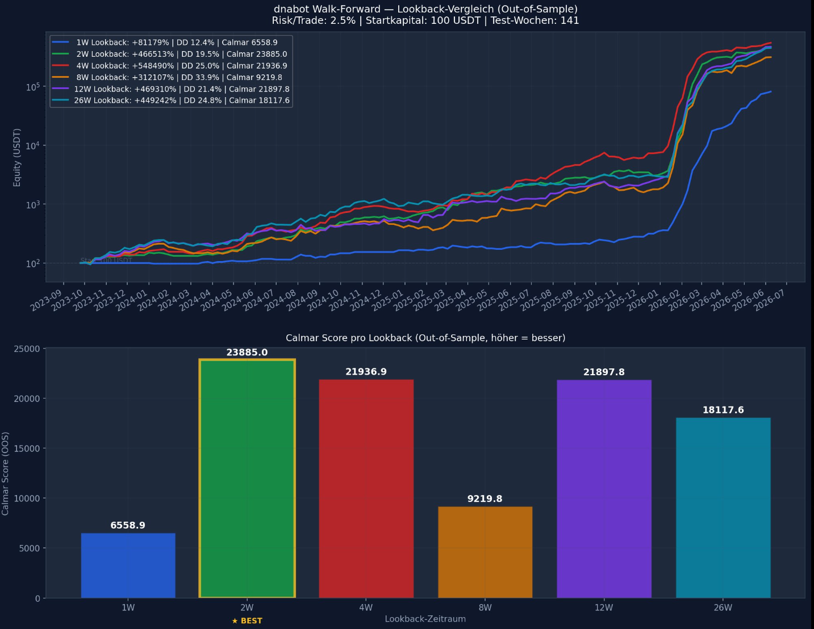

# dnabot — Adaptive Market Genome System

Ein selbstlernender Trading-Bot mit **zwei parallelen Strategien**, die dieselbe
Live-Infrastruktur (Trade-Management, Trailing-Stop, Self-Learning, Telegram)
teilen, aber auf grundverschiedenen Prinzipien beruhen:

| Strategie | Prinzip | Live-Status (2026-08-24) |
|---|---|---|
| **Genome-System** (`genome_logic.py`) | Kerzen als Gen-Sequenzen kodieren, Muster-Datenbank, Richtungsvorhersage | Nach 44 unabhängigen Recherche-Funden (siehe `research_dnabot_direction_calibration.md`) **kein robuster, filterbarer Richtungs-Edge in reinem OHLCV nachweisbar** — Architektur bleibt erhalten (Forschungswert, Self-Learning-Infrastruktur), aber ohne belastbare Live-Erwartung |
| **momentum_exit** (`momentum_exit_logic.py`) | **Kein** Vorhersage-Anspruch beim Einstieg (einfache Kerzen-Momentum-Fortsetzung) — der Edge steckt gezielt in Risiko-/Exit-Parametern (enges SL-Fenster + enger Trailing-Stop) | **Aktiv** für 7 Paare bei 6h (BTC/XRP/ETH/SOL/ADA/AAVE/DOGE), auf echten Bitget-Daten über die Live-Signalfunktion validiert (siehe unten) |

Keine neuronalen Netze, keine Black-Box — beide Strategien sind deterministisch
und vollständig nachvollziehbar.

> **Disclaimer:** Diese Software ist experimentell und dient ausschließlich Forschungszwecken.
> Der Handel mit Kryptowährungen birgt erhebliche finanzielle Risiken. Nutzung auf eigene Gefahr.
> Backtest-Ergebnisse (auch die unten gezeigten) sind keine Garantie für zukünftige Performance.

---

## Grundidee

Jede Kerze wird zu einem **Gen-Code** komprimiert:

```
B3H-UH
│││ ││
│││ │└── Volumen:    H = hoch (über 20er-MA), L = niedrig
│││ └─── Wick:       U = oben, D = unten, B = beide, N = keiner
││└───── Volatilität: H = hoch (Range ≥ ATR), L = niedrig
│└────── Körpergröße: 1 = klein (<30% ATR), 2 = mittel, 3 = groß
└─────── Richtung:   B = Bullish, S = Bearish
```

**96 mögliche Gene** — kombinatorisch, vollständig deterministisch.

Sequenzen aus 4–6 aufeinanderfolgenden Genen bilden ein **Genome**:

```
"B2H-NL | B3H-UH | S1L-DL | B2H-NH"
   ↓
Dieses Muster erschien 47x in der Vergangenheit.
30x davon stieg der Kurs danach > 1%.
→ Winrate: 63.8% | Score: 0.34 | Status: AKTIV
```

Der Bot handelt nur, wenn ein solches Genome im Live-Markt erkannt wird.

---

## Architektur

```
dnabot/
├── scan_and_learn.py              # Genome: Haupt-Lernprozess (Discovery + Evolver)
├── master_runner.py               # Cronjob-Orchestrator für Live-Trading (beide Strategien)
├── run_pipeline.sh                # Genome: Vollständige Pipeline (Discovery → Report)
│                                     Plattformübergreifend (Windows .venv/Scripts UND Unix .venv/bin)
├── show_results.sh                # Interaktive Analyse & Backtest-Menü (Genome)
├── run_analysis.sh                # 20 wissenschaftliche Analysen (Genome-spezifisch, siehe unten)
├── auto_optimizer_scheduler.py    # Automatischer Wochentimer: Discovery + Portfolio-Opt. (Genome)
├── run_backtest.py                # Genome: Einzel-Backtest pro Pair
├── run_portfolio_optimizer.py     # Genome: automatische Portfolio-Optimierung (exhaustive)
│                                     WICHTIG: bewahrt momentum_exit-Eintraege in active_strategies
│                                     unveraendert (write_to_settings() greift nur in Genome-Slots ein)
├── run_manual_portfolio.py        # Genome: manuelle Portfolio-Simulation (Pair-Auswahl)
├── backtest_momentum_exit.py      # momentum_exit: Backtest ueber die ECHTE Live-Signalfunktion
│                                     gegen frische Bitget-Daten (kein Nachbau)
├── risk_genome_discover.py        # momentum_exit: Discovery fuer Risiko-Gene (Pendant zu
│                                     scan_and_learn.py), IS/OOS-getrennt, echte simulate_trade()
├── run_momentum_exit_pipeline.sh  # momentum_exit: liest active_strategies, backtestet + Fee-Report
├── install.sh                     # Erstinstallation auf VPS
├── update.sh                      # Git-Update (sichert secret.json UND settings.json --
│                                     Live-Config wird NICHT durch Git ueberschrieben, siehe unten)
├── settings.json                  # Konfiguration (beide Strategien)
├── secret.json                    # API-Keys (nicht in Git)
│
└── src/dnabot/
    ├── genome/
    │   ├── encoder.py             # Kerze → Gen-String
    │   ├── database.py            # SQLite-Interface (Genome-Library)
    │   ├── discovery.py           # Pattern-Mining aus Historien-Daten
    │   └── evolver.py             # Scoring + Aktivierung/Deaktivierung
    │
    ├── genome/ (Fortsetzung)
    │   ├── risk_genome_db.py      # momentum_exit: SQLite-DB fuer Risiko-/Exit-Gene
    │   │                            (artifacts/db/risk_genome.db), spiegelt database.py
    │   └── risk_evolver.py        # momentum_exit: aktiviert bestes Gen nach Calmar-Ratio
    │
    ├── strategy/
    │   ├── genome_logic.py        # Genome: aktuelle Kerzen vs. DB → Signal
    │   ├── momentum_exit_logic.py # momentum_exit: Momentum-Einstieg (kein Vorhersage-Anspruch),
    │   │                            liest aktives Risiko-Gen live aus risk_genome_db
    │   │                            (siehe Fund AQ/AR in research_dnabot_direction_calibration.md)
    │   └── run.py                 # Entry Point -- strategy_type schaltet zwischen beiden um
    │
    ├── analysis/
    │   ├── backtester.py          # Genome: historische Simulation (simulate_trade() wird
    │   │                            auch von backtest_momentum_exit.py/risk_genome_discover.py
    │   │                            wiederverwendet)
    │   ├── interactive_chart.py   # Plotly Candlestick + Trade-Marker + Equity
    │   └── show_results.py        # Report: Genome-Library + Backtest (zeigt BEIDE Strategien,
    │                                liest einfach alle artifacts/results/backtest_*.json)
    │
    └── utils/
        ├── exchange.py            # Bitget CCXT Wrapper
        ├── trade_manager.py       # Entry/TP/SL + Self-Learning (beide DBs), strategy_type-Weiche
        ├── strategy_overrides.py  # Loest risk_overrides/genome_overrides/momentum_exit_overrides auf
        ├── telegram.py            # Telegram-Benachrichtigungen
        └── guardian.py            # Crash-Schutz Decorator

analysis/                          # Wissenschaftliche Analysen (run_analysis.sh, Menü 1-20 -- Genome-spezifisch)
├── fee_impact.py, monte_carlo.py, bootstrap_test.py, param_optimizer.py, ...
├── fee_impact_momentum_exit.py    # momentum_exit: isolierte Gebuehren-Analyse (kein Pool mit Genome)
├── show_risk_genes.py             # momentum_exit: Report aktive + Kandidaten-Gene (show_results.sh Mode 6)
└── strategy_comparison.py         # Menü 20: WF Re-Opt vs. Alle Configs (Langzeit-Vergleich)
```

---

## Wie das System lernt

### Phase 1 — Discovery (`scan_and_learn.py`)

```
Historische Daten (2 Jahre OHLCV)
    ↓
Alle Kerzen → Gene codieren
    ↓
Sliding Window (seq_len = 4, 5, 6)
    ↓
Für jedes Fenster: Was passierte danach? (strikt NACH dem Sequenz-Close)
  max_up > 1% UND max_up > max_down → LONG-Outcome
  max_down > 1% UND max_down > max_up → SHORT-Outcome
    ↓
Genome in SQLite speichern / aktualisieren
```

> Zukunfts-Kerzen werden ausschließlich nach dem Close der letzten Sequenz-Kerze bewertet
> (kein Lookahead-Bias). Discovery und Backtester nutzen dieselbe Indexlogik.

### Phase 2 — Evolution (`evolver.py`)

Der Evolver bewertet jedes Genome **pro Markt-Regime** separat:

```
Für jedes Regime (TREND / RANGE / NEUTRAL):
  Score_regime = winrate_regime × avg_move_pct × log(1 + occ_regime)

Ein Regime wird aktiviert wenn:
  - occ_regime  ≥ min_samples (statistisch belastbar)
  - winrate     ≥ 45%
  - score       ≥ 0.08

active_regimes = Liste der qualifizierenden Regime
  → z.B. ["RANGE", "NEUTRAL"]  (TREND zu unzuverlässig → nicht gehandelt)

Genome ist aktiv (active=1) wenn mindestens ein Regime qualifiziert.

Decay-Weighting (Occurrence-Decay, volatilitätsadjustiert):
  effective_occ = occ_regime × decay
  score_regime  = winrate × avg_move × log(1 + effective_occ)

  decay = e^(−age_days / effective_half_life)
  effective_half_life = half_life_days / vol_factor

  vol_factor = ATR / ATR_MA (aktuelle Marktvolatilität):
    vol_factor = 1.0 → half_life = 180d  (normal)
    vol_factor = 2.0 → half_life = 90d   (hohe Vol → schnellerer Decay)
    vol_factor = 0.5 → half_life = 360d  (niedrige Vol → langsamerer Decay)
```

**Beispiel:** Ein Genome mit 3 Regime-Profilen:

| Regime  | Samples | Winrate | Score  | Status   |
|---------|---------|---------|--------|----------|
| TREND   | 120     | 38%     | 0.06   | inaktiv  |
| RANGE   | 210     | 64%     | 0.41   | **aktiv** |
| NEUTRAL | 180     | 52%     | 0.19   | **aktiv** |

→ `active_regimes = ["RANGE", "NEUTRAL"]` — wird nur in diesen Phasen gehandelt.

### Phase 3 — Live-Trading

```
Jeder Cronjob-Lauf:
  1. Letzte 6 Kerzen codieren
  2. Sequenzen der Länge 4/5/6 gegen DB prüfen
  3. Bestes aktives Genome (höchster Score) → Signal
  4. Entry: Market-Order (sofort bei Sequenz-Abschluss)
  5. SL: Low/High der Sequenz-Kerzen (fester Trigger)
  6. Trailing Stop: aktiviert bei 2:1 R:R, Callback 1% (Bitget nativ)

Nach Trade-Abschluss:
  → Self-Learning: Trade-Ergebnis in Genome-DB schreiben
  → Winrate + Score werden für nächsten Evolver-Lauf aktualisiert
```

### Beispiel-Output (Live-Signal)

```
[Genome Signal]
  Sequenz:   B2H-NL | B3H-UH | S1L-DL | B2H-NH
  Richtung:  LONG
  Regime:    RANGE
  Score:     0.41
  Winrate:   64.3%  (RANGE: 134/210)
  Samples:   210    (RANGE-Regime)
  Entry:     ~43.250 USDT (Trigger-Limit)
  SL:         42.800 USDT (Sequenz-Low)
  TP:         44.150 USDT (2:1 R:R)
  → Platziere Trigger-Limit-Order...
```

---

## momentum_exit-Strategie (Risiko-/Exit-Engineering)

### Warum diese Strategie existiert

Eine ausführliche Recherche-Session (2026-08-24, 44 Funde, dokumentiert in
`research_dnabot_direction_calibration.md`) hat systematisch geprüft, ob sich
aus reinem OHLCV-Preis-/Volumenverlauf ein robuster **Richtungs-Edge**
gewinnen lässt — mit jeder methodisch unterschiedlichen Herangehensweise, die
sinnvoll ist: exakter Gen-Sequenz-Lookup (das Original-Genome-System),
kontinuierliche Feature-Modelle (logistische Regression, Gradient Boosting),
Domänen-Ensembles, ein genetischer Algorithmus mit voller Freiheit über den
gesamten Feature-Raum, echte Bioinformatik-Motiverkennung (Markov-Ketten mit
Backoff, wie bei der Suche nach Transkriptionsfaktor-Bindestellen), sowie
zusätzliche unabhängige Informationsachsen (Zustand von BTC als Marktsignal,
Handelssession/Uhrzeit). **Keiner dieser Ansätze fand einen Richtungs-Edge,
der auf einem zweiten, unabhängigen Zeitfenster reproduzierte.**

Der einzige Ansatz, der reproduzierte — und zwar deutlich — kehrt die Frage
um: Statt "welche Kerzensequenz sagt die Richtung vorher?" lautet sie
"welche Risiko-/Exit-Parameter erzeugen eine positive Kurve, **obwohl** der
Einstieg selbst keinen Vorhersage-Anspruch hat?" Das ist eine echte
Parallele zur Gentechnik: nicht länger nach Genen suchen, die zufällig
Richtung vorhersagen (das hat der genetische Algorithmus bereits erschöpfend
versucht), sondern gezielt Gene für eine Funktion entwerfen, für die es
bereits Evidenz gibt.

### Mechanik

```
Einstieg (KEIN Vorhersage-Anspruch):
  Richtung = eigene Kerzenrichtung der letzten Kerze (Momentum-Fortsetzung)
  KEIN Score-Gate, KEIN Regime-Filter -- jede Kerze wird potenziell gehandelt

Exit (HIER steckt der Edge -- Parameter kommen aus dem AKTIVEN Risiko-Gen,
siehe "Risiko-Gen-Datenbank" unten, nicht aus einer festen Konfiguration):
  SL = Low/High der letzten `seq_len` Kerzen (strukturell)
  TP-Aktivierung = Entry + rr_ratio × SL-Distanz
  Trailing Stop = trailing_pct nachgezogen, nativ über Bitget
                  place_trailing_stop_order (wie beim Genome-System)
```

Ergebnis-Profil (siehe R-Multiple-Diagnose in Fund AQ): **viele kleine
Verluste, aber ein Schwanz seltener großer Gewinner** — ein eng nachgezogener
Trailing-Stop lässt eine Position weiterlaufen, solange der Trend hält, und
gibt beim Umkehren nur wenig zurück. Klassisches Trendfolge-Payoff-Profil.

### Risiko-Gen-Datenbank (`risk_genome.db`) — echtes, lebendes Genom-System

Anders als eine erste Version dieser Strategie (feste, hart einprogrammierte
Parameter) ist momentum_exit jetzt **strukturell identisch zum Kerzen-Genome-
System aufgebaut** — nur ist ein "Gen" hier eine Risiko-/Exit-Parameter-
Kombination statt ein Kerzenmuster:

```
src/dnabot/genome/risk_genome_db.py   — SQLite-DB (artifacts/db/risk_genome.db)
                                          Tabellen: risk_genes, risk_gene_occurrences
                                          Spiegelt genome/database.py 1:1
src/dnabot/genome/risk_evolver.py     — aktiviert das Gen mit dem hoechsten
                                          Calmar (PnL/MaxDD) pro (Pair, Timeframe) --
                                          Selektionskriterium ist Calmar statt
                                          Winrate (siehe Fund AN: bei duennem
                                          Edge entscheidet die Positionsgroesse/
                                          der Drawdown ueber Profitabilitaet)
risk_genome_discover.py               — Pendant zu scan_and_learn.py: erzeugt
                                          Kandidaten-Gene aus einem festen
                                          Parameter-Raster (seq_len x rr_ratio x
                                          trailing_pct x risk_pct), backtestet
                                          jede Kombination mit der ECHTEN
                                          simulate_trade()-Funktion, waehlt via
                                          Evolver das beste Gen NUR auf dem
                                          IS-Anteil, prueft es DANACH einmalig
                                          auf dem echten, nie gesehenen 26-
                                          Wochen-OOS-Anteil -- nur bei
                                          positivem OOS-Calmar bleibt es aktiv
                                          (sonst deaktiviert es sich selbst)
```

`get_momentum_exit_signal(df, params, db)` liest live das **aktive** Gen fuer
das jeweilige Pair/Timeframe aus der DB und nutzt dessen `seq_len`/`rr_ratio`/
`trailing_pct`/`risk_pct` fuer JEDEN Trade. Nach jedem geschlossenen Trade
schreibt `trade_manager.py::self_learn_from_closed_trade()` das Ergebnis
zurueck in `risk_gene_occurrences` (`source='live'`) -- das aktive Gen lernt
laufend aus echten Ergebnissen, genau wie beim Kerzen-Genome-System.

**Kein aktives Gen fuer ein Pair/Timeframe → kein Signal, kein Trade**
(konservativ: kein blindes Handeln mit Default-Werten ohne validierte
Discovery).

### Discovery-Ergebnisse (2026-08-24, 7 Paare bei 6h, echte Bitget-Daten)

```bash
.venv/bin/python3 risk_genome_discover.py --symbol BTC/USDT:USDT --timeframe 6h
# oder ohne Argumente: alle momentum_exit-Paare aus active_strategies
.venv/bin/python3 risk_genome_discover.py
```

| Pair | Aktiviertes Gen | IS-Calmar | OOS n | OOS-Calmar | Status |
|---|---|---|---|---|---|
| BTC | seq5/rr3.0/trail0.5%/risk2.0% | 11.58 | 56 | 1.09 | ✅ Aktiv |
| XRP | seq5/rr1.5/trail0.5%/risk2.0% | 22.35 | 67 | 0.03 | ⚠️ Aktiv (sehr knapp) |
| ETH | seq5/rr1.5/trail0.5%/risk2.0% | 8.85 | 60 | 0.36 | ✅ Aktiv |
| SOL | seq5/rr3.0/trail0.5%/risk2.0% | 11.75 | 61 | **-0.26** | ❌ **Selbst deaktiviert** |
| ADA | seq5/rr1.5/trail0.5%/risk2.0% | 25.71 | 72 | 1.39 | ✅ Aktiv |
| AAVE | seq10/rr2.0/trail0.5%/risk2.0% | 12.17 | 56 | 1.91 | ✅ Aktiv |
| DOGE | seq10/rr3.0/trail0.5%/risk2.0% | 12.71 | 55 | 1.42 | ✅ Aktiv |

SOL wurde vom Evolver **automatisch deaktiviert**, weil das IS-beste Gen im
echten OOS-Test negativ war — deckt sich mit der urspruenglichen Recherche
(Fund AQ zeigte SOL dort ebenfalls als einziges klar negatives Paar). Das ist
ein starkes Konsistenz-Signal, dass der OOS-Gate-Mechanismus echt greift statt
nur simuliert gut auszusehen.

> **Offener Vorbehalt:** Alle 7 Paare wählten unabhängig voneinander das
> höchste getestete Risiko (`risk_pct=2.0%`) — dasselbe Muster, das beim
> ursprünglichen GA-Test bei 1h zur Explosion führte (Fund AN/AQ). Der OOS-
> Check fängt grobe Fehlschläge ab (siehe SOL), aber XRPs Bestätigung
> (Calmar 0.03) ist statistisch praktisch bedeutungslos. Vor einer laengeren
> Live-Phase lohnt es, die Risiko-Obergrenze in `RISK_CHOICES`
> (`risk_genome_discover.py`) probeweise niedriger anzusetzen und/oder die
> OOS-Schwelle in `evolve_risk_genes()`/`discover_pair()` strenger als
> "> 0" zu setzen.

**Nur 6h ist bisher discovered.** Fuer andere Timeframes: erst
`risk_genome_discover.py --symbol ... --timeframe ...` laufen lassen, bevor
`strategy_type: "momentum_exit"` dafuer aktiviert wird -- sonst bleibt das
Pair ohne aktives Gen und handelt schlicht nicht (sicherer Default).

### Konfiguration

`strategy_type: "momentum_exit"` in einem `active_strategies`-Eintrag
schaltet `trade_manager.py` komplett auf den momentum_exit-Signalpfad um --
das Genome-System wird für dieses Paar/Timeframe gar nicht mehr angefragt:

```json
{ "symbol": "BTC/USDT:USDT", "timeframe": "6h", "strategy_type": "momentum_exit",
  "momentum_exit_overrides": { "enabled": true } }
```

`risk_overrides`/`momentum_exit_overrides.seq_len` sind nur noch ein
**Fallback** fuer den Fall, dass kein aktives Gen in der DB existiert
(z.B. `backtest_momentum_exit.py` beim isolierten Testen neuer, noch nicht
discovered Parameter, aufgerufen ohne DB) -- im Live-Betrieb (mit DB)
ueberschreibt das aktive Gen diese Werte pro Trade.

Globaler Schalter (Fallback, falls kein `momentum_exit_overrides.enabled`
pro Strategie gesetzt ist) in `settings.json`:

```json
"momentum_exit_settings": { "enabled": false, "seq_len": 5 }
```

### Backtest & Reporting

```bash
# Risiko-Gen-Discovery (neu/aktualisieren) -- Pendant zu scan_and_learn.py
.venv/bin/python3 risk_genome_discover.py

# Report: aktive + Kandidaten-Gene pro Pair (auch ueber show_results.sh -> Mode 6)
.venv/bin/python3 analysis/show_risk_genes.py

# Einzelnes Pair, eigene (noch nicht discovered) Parameter isoliert testen
.venv/bin/python3 backtest_momentum_exit.py --symbol BTC/USDT:USDT --timeframe 6h \
    --capital 1000 --risk 1.0 --rr-ratio 1.5 --trailing-callback-pct 0.5 --seq-len 5 --oos-weeks 26

# Alle momentum_exit-Strategien aus active_strategies, mit GENAU deren statischen
# Fallback-Parametern (NICHT den DB-Genen -- fuer DB-gesteuerte Zahlen: show_risk_genes.py)
./run_momentum_exit_pipeline.sh
# -> backtestet jedes Pair + isolierte Gebuehren-Impact-Analyse am Ende
#    (analysis/fee_impact_momentum_exit.py -- NICHT analysis/fee_impact.py,
#    das poolt alle Strategien inkl. Genome zusammen und ist dadurch irrefuehrend)
```

> **Automatische Aktualisierung:** `auto_optimizer_scheduler.py` ruft bei
> jedem Lauf (mit UND ohne `optimization_settings.enabled`) zusaetzlich zum
> Kerzen-Genome-Scan auch `risk_genome_discover.py` auf -- die Risiko-Gene
> bleiben damit auf demselben Zeitplan aktuell wie das Kerzen-System, ohne
> eigenen Cronjob.

---

## Markt-Regime

> Gilt nur für das **Genome-System**. `momentum_exit` verwendet bewusst
> keinen Regime-Filter (der validierte Research-Code hatte auch keinen --
> siehe momentum_exit-Abschnitt oben).

Das System erkennt vier Marktphasen und handelt nur in den erlaubten:

```
TREND    — ADX > 25            Klare Richtung, Momentum-Genome profitieren
RANGE    — ADX < 20            Seitwärtsmarkt, Reversal-Genome profitieren
HIGH_VOL — ATR > ATR_MA × 1.5  Unkontrollierte Volatilität → immer blockiert
NEUTRAL  — sonst               Übergangsphase, vorsichtiger Handel möglich
```

**Warum das wichtig ist:** Ein Genome das im Range-Markt 64% Winrate hat,
kann im Trend 38% verlieren — und umgekehrt. Der Regime-Filter ist die
wirksamste Einzelmaßnahme gegen Fehlsignale.

---

## Genome-Datenbank

SQLite unter `artifacts/db/genome.db`.
Eine Zeile pro Genome (eindeutig durch Sequenz + Markt + Timeframe + Richtung):

| Feld | Beispiel | Bedeutung |
|---|---|---|
| `genome_id` | `a3f2b9c1...` | MD5-Hash (eindeutiger Schlüssel) |
| `sequence` | `B2H-NL\|B3H-UH\|S1L-DL\|B2H-NH` | Gen-Sequenz |
| `market` | `BTC/USDT:USDT` | Handelspaar |
| `timeframe` | `4h` | Zeitrahmen |
| `direction` | `LONG` | Erwartete Richtung |
| `total_occurrences` | `47` | Wie oft dieses Muster in der History auftrat |
| `wins` | `30` | Wie oft danach die erwartete Bewegung kam |
| `avg_move_pct` | `1.84` | Durchschnittliche Preisbewegung in % |
| `score` | `0.34` | Bester Regime-Score |
| `active` | `1` | Vom Evolver freigegeben |
| `occ_trend` / `wins_trend` | `120` / `46` | Vorkommen + Wins im TREND-Regime |
| `occ_range` / `wins_range` | `210` / `134` | Vorkommen + Wins im RANGE-Regime |
| `occ_neutral` / `wins_neutral` | `180` / `94` | Vorkommen + Wins im NEUTRAL-Regime |
| `active_regimes` | `["RANGE","NEUTRAL"]` | Regime, in denen das Genome gehandelt wird |

---

## Konfiguration (`settings.json`)

```json
{
    "live_trading_settings": {
        "active_strategies": [
            { "symbol": "BTC/USDT:USDT", "timeframe": "4h", "active": false },
            { "symbol": "ETH/USDT:USDT", "timeframe": "1h", "active": false },

            { "symbol": "SOL/USDT:USDT", "timeframe": "6h", "strategy_type": "momentum_exit",
              "risk_overrides": { "rr_ratio": 1.5, "risk_per_entry_pct": 1.0, "trailing_callback_rate_pct": 0.5 },
              "momentum_exit_overrides": { "enabled": true, "seq_len": 5 } }
        ]
    },
    "scan_settings": {
        "discovery_horizon": 5,
        "move_threshold_pct": 1.0,
        "min_samples_to_activate": 80
    },
    "genome_settings": {
        "sequence_lengths": [4, 5, 6],
        "min_score": 0.08,
        "min_winrate": 0.45,
        "half_life_days": 180
    },
    "momentum_exit_settings": {
        "enabled": false,
        "seq_len": 5
    },
    "risk_settings": {
        "risk_per_entry_pct": 1.0,
        "leverage": 5,
        "margin_mode": "isolated",
        "rr_ratio": 2.0,
        "trailing_callback_rate_pct": 1.0
    },
    "optimization_settings": {
        "enabled": true,
        "schedule": {
            "day_of_week": 6,
            "hour": 3,
            "minute": 0,
            "interval": { "value": 7, "unit": "days" }
        },
        "start_capital": 1000,
        "risk_pct": 1.0,
        "max_drawdown_pct": 30,
        "send_telegram_on_completion": true
    }
}
```

> `strategy_type` fehlt oder `"genome"` → normales Genome-System.
> `strategy_type: "momentum_exit"` → siehe eigener Abschnitt oben. Der
> Auto-Optimizer (`run_portfolio_optimizer.py`) bewahrt momentum_exit-
> Einträge beim automatischen Neuschreiben von `active_strategies`
> unverändert -- er wählt nur unter Genome-Strategien.

> **Automatische Ableitung:** `scan_settings`-Felder werden automatisch nach Timeframe gewählt — nichts muss gesetzt werden:
>
> | Parameter | 1h | 4h | 1d |
> |---|---|---|---|
> | `history_days` | 365d | 730d | 1095d |
> | `discovery_horizon` | 24 Kerzen | 6 Kerzen | 3 Kerzen |
> | `move_threshold_pct` | 0.5% | 1.0% | 2.0% |
> | `min_samples_to_activate` | 8 | 5 | 3 |
>
> Die (Symbol, Timeframe)-Paare werden direkt aus `active_strategies` übernommen.

| Parameter | Erklärung |
|---|---|
| `history_days` | Auto nach Timeframe (4h→730d, 1h→365d, 1d→1095d). Explizit setzen für festen Wert. |
| `discovery_horizon` | Auto nach Timeframe (~1 Tag Lookahead: 4h→6, 1h→24, 1d→3). |
| `move_threshold_pct` | Auto nach Timeframe (4h→1.0%, 1h→0.5%, 1d→2.0%). |
| `min_samples_to_activate` | Auto nach Timeframe (4h→5, 1h→8, 1d→3). |
| `min_score` | Mindest-Score nach Decay (0.08 = guter Startpunkt). |
| `min_winrate` | Mindest-Winrate (0.45 = 45%). |
| `half_life_days` | Halbwertszeit für Score-Decay (180 = 6 Monate). |
| `risk_per_entry_pct` | % des Guthabens als Risiko pro Trade. |
| `rr_ratio` | Risk-Reward-Ratio (2.0 = 1:2) — bestimmt Aktivierungspreis des Trailing Stops. |
| `trailing_callback_rate_pct` | Trailing Stop Callback in % (1.0 = 1% Rückzug vom Peak löst aus). |
| `optimization_settings.enabled` | Automatische wöchentliche Neu-Optimierung ein/aus. |
| `optimization_settings.schedule` | Wochentag + Uhrzeit + Intervall für den Auto-Optimizer. |
| `optimization_settings.max_drawdown_pct` | Maximaler erlaubter Drawdown für Portfolio-Auswahl. |
| `momentum_exit_settings.enabled` | Globaler Fallback für `strategy_type: "momentum_exit"`-Strategien ohne eigenes `momentum_exit_overrides.enabled`. Standard: `false`. |
| `momentum_exit_settings.seq_len` | Struktureller SL-Rueckblick in Kerzen (Fund AQ 6h-Default: 5). Ueberschreibbar pro Strategie via `momentum_exit_overrides.seq_len`. |

---

## Installation 🚀

#### 1. Projekt klonen

```bash
git clone https://github.com/Youra82/dnabot.git
cd dnabot
```

#### 2. Installations-Skript ausführen

```bash
chmod +x install.sh
bash ./install.sh
```

Das Skript erstellt die virtuelle Python-Umgebung, installiert alle Abhängigkeiten und legt die Verzeichnisstruktur an.

#### 3. API-Keys eintragen

```bash
cp secret.json.example secret.json
nano secret.json
```

```json
{
    "dnabot": [
        {
            "name": "Main-Account",
            "apiKey": "DEIN_API_KEY",
            "secret": "DEIN_SECRET",
            "password": "DEIN_PASSPHRASE",
            "telegram_bot_token": "DEIN_BOT_TOKEN",
            "telegram_chat_id": "DEINE_CHAT_ID"
        }
    ]
}
```

---

## Workflow

#### 1. Coins und Timeframes einstellen

```bash
nano settings.json
```

```json
"active_strategies": [
    { "symbol": "BTC/USDT:USDT", "timeframe": "4h", "active": false },
    { "symbol": "ETH/USDT:USDT", "timeframe": "1h", "active": false }
]
```

#### 2. Genome-Discovery starten (Pipeline)

```bash
./run_pipeline.sh
```

Die Pipeline lädt historische Daten, entdeckt Muster, bewertet sie und zeigt eine Zusammenfassung. Dauert je nach Anzahl der Märkte 10–30 Minuten.

#### 3. Ergebnisse analysieren & Portfolio optimieren

```bash
./show_results.sh
```

| Modus | Funktion |
|---|---|
| **1) Einzel-Backtest** | Simuliert jedes Pair einzeln — zeigt WR, PnL, Drawdown pro Pair. |
| **2) Manuelle Portfolio-Simulation** | Du wählst Pairs aus einer Liste (Nummern oder `alle`), der Bot simuliert das kombinierte Portfolio mit gemeinsamem Kapital-Pool und optionalem Telegram-Versand. |
| **3) Automatische Portfolio-Opt.** | Exhaustive Suche über alle Pair-Kombinationen — der Bot wählt das Team mit maximalem PnL bei gegebenem Max-Drawdown. Schreibt Ergebnis in `settings.json`. Optional: kombinierten Portfolio-Equity-Chart via Telegram senden. |
| **4) Genome Bibliothek** | Top-Patterns, Score-Verteilung und Statistiken aus der Genome-DB. |
| **5) Interaktive Charts** | Candlestick + Entry/Exit-Marker + Equity-Kurve als HTML (Plotly). |

**Portfolio-Simulation (Modus 2 & 3):**
- Alle Trades aller gewählten Pairs werden **chronologisch zusammengeführt**
- Jeder Trade riskiert `risk_pct%` des **aktuellen** Equity (Kompoundierung)
- Constraint: max. 1 Timeframe pro Coin (Bitget erlaubt nur 1 offene Position pro Symbol)

> ⚠️ **Portfolio-Optimierung liest ALLE vorhandenen `artifacts/results/backtest_*.json`**,
> unabhängig davon wann/womit sie erzeugt wurden — auch von Pairs, die gerade gar nicht
> neu gescannt wurden. Nach Änderungen an der Discovery-/Backtest-Logik (Alphabet,
> min_samples, Filter, …) sind alte Backtest-Dateien anderer Pairs nicht mehr vergleichbar
> mit frisch erzeugten. Vor einer Portfolio-Optimierung nach so einer Änderung erst
> `rm -f artifacts/results/backtest_*.json` und alle relevanten Pairs neu scannen/backtesten,
> sonst mischt die Auswahl alten und neuen Pipeline-Stand.

#### 4. Strategien live schalten

Nach der Portfolio-Optimierung (Modus 3) werden die optimalen Strategien automatisch in `settings.json` eingetragen. Alternativ manuell:

```bash
nano settings.json
```

```json
{ "symbol": "BTC/USDT:USDT", "timeframe": "4h", "active": true }
```

#### 5. Cronjob einrichten

```bash
crontab -e
```

```cron
# dnabot -> offset 60s (startet auch den Telegram-Listener falls nicht aktiv)
*/15 * * * * /usr/bin/flock -n /home/matola/dnabot/dnabot.lock /bin/sh -c "sleep 60; OMP_NUM_THREADS=1 MKL_NUM_THREADS=1 TF_NUM_INTRAOP_THREADS=1 TF_NUM_INTEROP_THREADS=1 cd /home/matola/dnabot && pgrep -f 'telegram_listener.py' > /dev/null || nohup /home/matola/dnabot/.venv/bin/python3 /home/matola/dnabot/telegram_listener.py >> /home/matola/dnabot/logs/telegram_listener.log 2>&1 & /home/matola/dnabot/.venv/bin/python3 master_runner.py >> /home/matola/dnabot/logs/cron.log 2>&1"
```

> Der `master_runner.py` ruft beim Start automatisch den `auto_optimizer_scheduler.py` auf.
> Dieser prüft ob eine Neu-Optimierung fällig ist und führt sie dann automatisch aus.
> Ein separater Cronjob für wöchentliches Re-Learning ist **nicht nötig**.

---

## Automatische Wochentimer-Optimierung

Der `auto_optimizer_scheduler.py` läuft non-blocking bei jedem `master_runner.py`-Aufruf:

```
master_runner.py startet
    ↓
auto_optimizer_scheduler.py prüft: Ist Optimierung fällig?
    ├── Nein → sofort beendet (kein Overhead)
    └── Ja →
           scan_and_learn.py           (neue Genome discovern + evolven)
               ↓
           risk_genome_discover.py     (Risiko-Gene fuer momentum_exit
                                         aktualisieren -- eigener Pfad,
                                         unabhaengig vom Genome-Scan-Erfolg)
               ↓
           run_portfolio_optimizer.py --auto-write
               (bestes GENOME-Team ermitteln → settings.json aktualisieren --
                momentum_exit-Eintraege bleiben dabei unangetastet, siehe
                run_portfolio_optimizer.py::write_to_settings())
               ↓
           Telegram: Start + Ende Benachrichtigung
```

Konfiguration in `settings.json` unter `optimization_settings`:

```json
"optimization_settings": {
    "enabled": true,
    "schedule": {
        "day_of_week": 6,
        "hour": 3,
        "minute": 0,
        "interval": { "value": 7, "unit": "days" }
    },
    "start_capital": 1000,
    "risk_pct": 1.0,
    "max_drawdown_pct": 30,
    "send_telegram_on_completion": true
}
```

Manuell erzwingen:

```bash
.venv/bin/python3 auto_optimizer_scheduler.py --force
```

---

## Wissenschaftliche Analysen

> **Nur fuer das Genome-System.** Alle 20 Analysen unten pruefen Konzepte,
> die spezifisch fuer Kerzen-Gen-Sequenzen sind (Sequenzlaengen, Alphabet-
> Score, Regime-Filter, Genome-Decay) und auf momentum_exit nicht sinnvoll
> uebertragbar sind (dort gibt es weder Sequenzlaengen noch Regime-Filter).
> Bewusste Entscheidung, das NICHT pauschal zu erweitern -- fuer momentum_exit
> siehe stattdessen `risk_genome_discover.py` (Discovery) und
> `analysis/show_risk_genes.py` (Report) im Abschnitt oben.

Alle 20 Analysen sind unter **einem einzigen interaktiven Befehl** zusammengefasst.
Jede Analyse sendet automatisch einen **Chart + Zusammenfassung via Telegram**.

```bash
./run_analysis.sh                 # interaktives Menü
./run_analysis.sh --no-telegram   # nur lokale Charts, kein Telegram
```

```
=======================================================
  dnabot — Wissenschaftliche Analysen
=======================================================

  ── Priorität 1: Fundament ──────────────────────────
   1) Walk-Forward Lookback-Analyse
   2) Slippage & Fee Impact
   3) Monte Carlo Simulation
   4) Bootstrap Signifikanztest

  ── Priorität 2: Direkte Gewinnoptimierung ──────────
   5) RR-Ratio Optimierung          (Walk-Forward)
   6) Score Threshold Sweep         (Walk-Forward)
   7) Trailing Callback Optimierung (Walk-Forward)
   8) Parameter Sensitivity         (Tornado-Diagramm)

  ── Priorität 3: Systemverbesserung ─────────────────
   9) Multi-Timeframe Confirmation
  10) Genome Decay Analysis
  11) Anti-Korrelations-Portfolio
  12) Kelly Position Sizing

  ── Priorität 4–6: Feintuning & Portfolio ───────────
  13) Regime Performance Analysis
  14) Sequenzlängen-Analyse
  15) Confluence Score
  16) Volatilitäts-Filter Optimierung
  17) Tageszeit-Analyse
  18) Regime-adaptive Parameter
  19) Drawdown Duration Analysis

  ── Strategie-Vergleich ──────────────────────────────
  20) WF Re-Opt vs. Alle Configs       (Langzeit-Vergleich)

   0) Alle 20 Analysen nacheinander ausführen
```

Charts werden unter `docs/` gespeichert und via Telegram gesendet.

> **Voraussetzung für Analysen 2–8, 11–12, 14–20:** Backtest-Daten müssen vorhanden sein.
> Erst mit einem langen Zeitraum generieren:
> ```bash
> ./show_results.sh  # → Mode 1 → Startdatum: 2025-01-01
> ```

---

### 1) Walk-Forward Lookback-Analyse

**Frage:** Wie viele Wochen zurück soll der Auto-Optimizer schauen um das beste Portfolio zu wählen?

Der wöchentliche Auto-Optimizer läuft einmal pro Woche und wählt Pairs anhand ihrer Performance im Lookback-Fenster. Zu kurz = zu wenig Daten, reaktiv. Zu lang = blind für aktuelle Marktlage.

**Methode:** Rolling Walk-Forward ohne Lookahead. Für jeden Lookback (1, 2, 4, 8, 12, 26 Wochen) wird jede Woche simuliert: In-Sample → Portfolio wählen → Out-of-Sample → Equity akkumulieren. Alle Lookbacks auf demselben OOS-Zeitraum (fairer Vergleich).

**Ergebnis:** Equity-Kurven aller Lookbacks + Calmar-Tabelle via Telegram.

#### Beispiel-Ergebnis (167 Wochen Daten, 141 Test-Wochen OOS)



```
Lookback  1W   DD=12.4% | Calmar= 6559 | Leerwochen=53  ← zu wenig Daten
Lookback  2W   DD=19.5% | Calmar=23885 | Leerwochen=11  ← ★ bestes Calmar
Lookback  4W   DD=25.0% | Calmar=21937 | Leerwochen= 7
Lookback  8W   DD=33.9% | Calmar= 9220 | Leerwochen= 4
Lookback 12W   DD=21.4% | Calmar=21898 | Leerwochen= 4
Lookback 26W   DD=24.8% | Calmar=18118 | Leerwochen= 4
```

**Leerwochen** = Wochen ohne qualifizierendes Pair (zu wenig Trades im Fenster).

Ergebnis in `settings.json` übernehmen:
```json
"optimization_settings": { "backtest_lookback_weeks": 2 }
```

---

### 2) Slippage & Fee Impact

**Frage:** Ist der Bot nach realen Gebühren und Slippage noch profitabel?

**Methode:** Zwei Sweeps auf allen Backtest-Trades:
- **Gebühren-Sweep:** 0% bis 0.20% pro Seite (Bitget Taker = 0.06%) — jeweils Round-Trip berechnet
- **Slippage-Sweep:** 0% bis 0.20% zusätzlicher Verlust bei SL-Execution (fixer Gebührensatz 0.06%)

**Ergebnis:** Balkendiagramm (PnL% je Gebühr/Slippage) + **Break-Even-Gebühr** via Telegram.

**Was man lernt:** Wenn der Break-Even bei 0.04%/Seite liegt, ist das System sehr empfindlich — schon 0.06% Taker-Gebühr macht es unrentabel. Liegt er bei 0.15%+, hat das System robuste Gewinnmargen.

---

### 3) Monte Carlo Simulation

**Frage:** Was ist das realistisch schlechteste Ergebnis? Wie hoch ist das Ruin-Risiko?

**Methode:** 10.000 zufällige Permutationen der echten Trade-Sequenz. Jede Permutation simuliert dieselben Trade-Ergebnisse in anderer Reihenfolge. Der Median und die Perzentile zeigen die Verteilung möglicher Ergebnisse.

**Ergebnis:** Zwei Histogramme (Final-PnL-Verteilung + MaxDD-Verteilung) mit Perzentil-Markierungen via Telegram.

| Kennzahl | Bedeutung |
|---|---|
| 5. Perzentil | Das schlechteste Ergebnis in 95% der Fälle |
| Median | Erwartetes mittleres Ergebnis |
| 95. Perzentil | Das beste Ergebnis in 95% der Fälle |
| Ruin-Wahrsch. | Anteil Pfade mit Equity < 50% des Startkapitals |

**Interpretation:** Ruin-Wahrscheinlichkeit < 1% = robust. > 10% = Risk% reduzieren.

---

### 4) Bootstrap Signifikanztest

**Frage:** Sind die Genome-Win-Raten statistisch signifikant oder nur Zufall?

**Methode:** Binomialtest pro aktivem Genome. Nullhypothese: Win-Rate = 50% (Zufall). Einseitiger Test: Ist die gemessene WR signifikant **über** 50%? Ergebnis: p-Wert pro Genome. Signifikant = p < 0.05.

**Ergebnis:** Scatter (WR vs. Sample-Größe, grün = signifikant) + p-Wert-Histogramm via Telegram.

**Was man lernt:** Wenn 80% der aktiven Genome statistisch signifikant sind → das System erkennt echte Muster. Wenn nur 30% signifikant sind → viele Genome sind Zufall und sollten durch strengere `min_score`/`min_winrate` gefiltert werden.

**Voraussetzung:** `pip install scipy` (einmalig auf dem VPS).

---

### 5) RR-Ratio Optimierung (Walk-Forward)

**Frage:** Ist 2:1 R:R wirklich optimal oder ist 1.5:1 oder 3:1 besser?

**Methode:** Walk-Forward für RR-Werte 1.0, 1.5, 2.0, 2.5, 3.0 — identisch zu Analyse 1, aber der Parameter ist das RR. Kein Lookahead: jede Woche wird mit dem in der Vorwoche gewählten RR simuliert.

**Ergebnis:** Equity-Kurven aller RR-Werte + Calmar-Tabelle via Telegram. Optimaler Wert direkt in `settings.json` übernehmbar.

**Direkte Auswirkung:** Das RR bestimmt den Aktivierungspreis des Trailing Stops. Zu hoch = Trailing Stop wird selten aktiviert (viele SL-Hits). Zu niedrig = früher in Gewinn aber kleiner Gewinn pro Win.

---

### 6) Score Threshold Sweep (Walk-Forward)

**Frage:** Welcher `min_score` liefert das beste Verhältnis aus Trade-Anzahl und Win-Rate?

**Methode:** Walk-Forward für min_score-Werte 0.01, 0.05, 0.08, 0.12, 0.15, 0.20, 0.30.
- Niedrig = mehr Trades, niedrigere Win-Rate (mehr Rauschen erlaubt)
- Hoch = weniger Trades, höhere Win-Rate (nur starke Signale)

**Ergebnis:** Equity-Kurven aller Schwellwerte + Calmar-Tabelle via Telegram. Optimaler Wert direkt in `settings.json` übernehmbar (`genome_settings.min_score`).

---

### 7) Trailing Callback Optimierung (Walk-Forward)

**Frage:** Ist 1% Callback optimal oder verlässt man Gewinner zu früh / zu spät?

**Methode:** Walk-Forward für Callback-Werte 0.3, 0.5, 0.8, 1.0, 1.5, 2.0, 3.0%.
- Klein = enger Trailing Stop → wird früher ausgelöst, weniger Gewinn pro Trade
- Groß = weiter Trailing Stop → mehr Gewinn bei starken Bewegungen, mehr Gegenbewegung toleriert

**Ergebnis:** Equity-Kurven + Calmar-Tabelle via Telegram. Optimaler Wert direkt in `settings.json` übernehmbar (`risk_settings.trailing_callback_rate_pct`).

---

### 8) Parameter Sensitivity Analysis

**Frage:** Wie robust ist das System? Machen kleine Parameteränderungen alles kaputt?

**Methode:** Jeder der 5 Haupt-Parameter wird ±30% variiert (in 7 Stufen: −30%, −20%, −10%, 0%, +10%, +20%, +30%). Calmar-Änderung gegenüber Basis wird gemessen.

| Parameter | Basis | Testbereich |
|---|---|---|
| `rr_ratio` | 2.0 | 1.4 – 2.6 |
| `min_score` | 0.08 | 0.056 – 0.104 |
| `min_winrate` | 0.45 | 0.315 – 0.585 |
| `half_life_days` | 180 | 126 – 234 |
| `trailing_callback_pct` | 1.0 | 0.7 – 1.3 |

**Ergebnis:** Tornado-Diagramm via Telegram.
- Breiter Balken = sensitiver Parameter = Overfitting-Risiko
- Schmaler Balken = robuster Parameter = System ist stabil

**Was man lernt:** Wenn `min_score` einen sehr breiten Balken hat → der Bot ist stark vom Schwellwert abhängig → Vorsicht mit manuellen Anpassungen.

---

### 9) Multi-Timeframe Confirmation

**Frage:** Performen Signale besser wenn sie gleichzeitig auf mehreren Coins/Pairs auftreten?

**Methode:** Trades werden nach Anzahl gleichzeitiger Signale im Zeitfenster (Standard: 2h) gruppiert. `n=1` = Einzelsignal, `n=2` = zwei Signals gleichzeitig, `n=3+` = starkes Confluence.

**Ergebnis:** Win-Rate und Calmar nach Confluence-Stufe via Telegram.

**Was man lernt:** Wenn `n=2+` signifikant besser ist → zukünftig nur bei Mehrfach-Bestätigung handeln (→ Confluence Score, Analyse 15). Wenn kein Unterschied → Einzelsignale sind ausreichend.

---

### 10) Genome Decay Analysis

**Frage:** Verlieren Genome mit der Zeit ihre Vorhersagekraft? Ist `half_life_days=180` korrekt?

**Methode:** Aktive Genome werden nach Alter (Tage seit `last_seen`) in Altersgruppen eingeteilt: 0–30d, 30–60d, 60–90d, 90–180d, 180–365d, >365d. Ø Win-Rate und Ø Score pro Gruppe.

**Ergebnis:** Balkendiagramm (WR nach Alter) + Score-Verlauf vs. theoretischem Decay-Verlauf via Telegram.

**Was man lernt:**
- Win-Rate fällt mit dem Alter → Decay ist real → `half_life_days` korrekt gesetzt
- Win-Rate konstant über alle Alter → Decay zu aggressiv → `half_life_days` erhöhen
- Stark fallende Win-Rate nach 60d → Decay zu langsam → `half_life_days` reduzieren

---

### 11) Anti-Korrelations-Portfolio

**Frage:** Welche Pairs verlieren und gewinnen selten gleichzeitig?

**Methode:** Aus den Backtest-Trades wird pro Pair eine wöchentliche PnL-Zeitreihe erstellt. Pearson-Korrelationsmatrix aller Pairs. Negativ korrelierte Pairs kompensieren sich gegenseitig → geringerer Portfolio-Drawdown.

**Ergebnis:** Heatmap der Korrelationsmatrix + Liste der besten (anti-korrelierten) Pair-Kombinationen via Telegram.

**Was man lernt:** Pairs die stark positiv korrelieren (>0.7) sollten nicht gleichzeitig im Portfolio sein — sie fallen und steigen gemeinsam, ohne Diversifikationsvorteil.

---

### 12) Kelly Position Sizing

**Frage:** Wie viel sollte man pro Genome riskieren — mathematisch optimal?

**Methode:** Kelly-Kriterium pro aktivem Genome:
```
Kelly% = (WR × RR − (1−WR)) / RR
Half-Kelly (empfohlen) = Kelly% / 2
```

Genome mit hoher Win-Rate und gutem RR dürfen mehr riskiert werden. Schwache Genome weniger.

**Ergebnis:** Ranking aller aktiven Genome nach optimalem Kelly-Einsatz + Vergleich aktueller vs. Kelly-Risk via Telegram.

**Was man lernt:** Wenn das aktuelle `risk_per_entry_pct=5%` für die meisten Genome deutlich über Half-Kelly liegt → das Risiko ist zu hoch und sollte reduziert werden. Kelly gibt die mathematisch optimale Wachstumsrate des Kapitals.

---

### 13) Regime Performance Analysis

**Frage:** In welchen Marktphasen funktioniert welches Genome am besten?

**Methode:** Direkt aus der Genome-Datenbank — die per-Regime-Spalten (`occ_trend/wins_trend`, `occ_range/wins_range`, `occ_neutral/wins_neutral`) werden aggregiert und verglichen.

**Ergebnis:** Balkendiagramm (Win-Rate pro Regime pro Coin/Pair) + Tabelle via Telegram.

**Was man lernt:** Wenn TREND-Regime durchgängig schlechte Win-Raten zeigt → TREND aus `allowed_regimes` in `settings.json` entfernen. Das kann die Gesamtperformance erheblich verbessern.

```json
"genome_settings": { "allowed_regimes": ["RANGE", "NEUTRAL"] }
```

---

### 14) Sequenzlängen-Analyse

**Frage:** Sind 4er, 5er oder 6er Sequenzen profitabler? Erzeugen 5er mehr Rauschen?

**Methode:** Walk-Forward getrennt für jede Sequenzlänge: einmal nur 4er Sequenzen, einmal nur 5er, einmal nur 6er, einmal alle kombiniert. Calmar-Vergleich.

**Ergebnis:** Equity-Kurven nach Sequenzlänge via Telegram.

**Was man lernt:** Wenn 5er Sequenzen deutlich schlechter abschneiden → aus `sequence_lengths` entfernen. Das vereinfacht das System und reduziert Rauschen in der Genome-DB.

```json
"genome_settings": { "sequence_lengths": [4, 6] }
```

---

### 15) Confluence Score

**Frage:** Was passiert wenn man nur handelt wenn mehrere Genome gleichzeitig dasselbe signalisieren?

**Methode:** Trades aus dem Backtest werden nach Anzahl gleichzeitiger gleichgerichteter Signale im Zeitfenster gefiltert. Simuliert: `min_confluence=1` (alles), `=2` (2+ Genome), `=3` (starkes Signal).

**Ergebnis:** Vergleich Win-Rate, Trade-Anzahl und Calmar je Confluence-Schwellwert via Telegram.

**Was man lernt:** Höhere Confluence = weniger Trades aber tendenziell bessere Qualität. Der Trade-off zwischen Trade-Anzahl und WR zeigt den optimalen Schwellwert.

---

### 16) Volatilitäts-Filter Optimierung

**Frage:** Der HIGH_VOL-Filter blockiert bei ATR > 1.5× ATR-MA — ist das der richtige Schwellwert?

**Methode:** Simuliert das Portfolio mit verschiedenen ATR-Schwellwerten: 1.0×, 1.5×, 2.0×, 2.5×, 3.0×.
- Niedrig = mehr Trades geblockt (konservativ)
- Hoch = mehr Trades erlaubt (aggressiv, auch bei hoher Volatilität)

**Ergebnis:** Calmar-Vergleich aller Schwellwerte via Telegram.

**Was man lernt:** Wenn 2.0× besser ist als 1.5× → der aktuelle Filter ist zu aggressiv und blendet profitable Trades aus. Direkter Handlungshinweis für den Code.

---

### 17) Tageszeit-Analyse

**Frage:** Performen Genome-Signale zu bestimmten Tageszeiten besser?

**Methode:** Alle Backtest-Trades werden nach Einstiegs-Uhrzeit (UTC) in Sessions gruppiert:
- **Asia:** 01:00–09:00 UTC
- **Europe:** 09:00–17:00 UTC
- **US:** 17:00–01:00 UTC

Win-Rate, PnL und Calmar pro Session.

**Ergebnis:** Balkendiagramm + Heatmap (Stunde vs. Win-Rate) via Telegram.

**Was man lernt:** Krypto handelt 24/7 — wenn bestimmte Stunden konstant negative Calmar zeigen, kann man Entry-Zeiten einschränken. Oft zeigt sich: London/NY-Overlap (13–17 UTC) ist liquider und Signale sind zuverlässiger.

---

### 18) Regime-adaptive Parameter

**Frage:** Sollte man in TREND anderen RR verwenden als in RANGE?

**Methode:** Simuliert das Portfolio mit verschiedenen RR-Gruppen je nach Timeframe:
- **Kurzfristig (1h/2h):** RR 1.5, 2.0, 2.5
- **Mittelfristig (4h/6h):** RR 2.0, 2.5, 3.0
- Alle Kombinationen werden verglichen.

**Ergebnis:** Heatmap (Timeframe-Gruppe vs. RR-Wert → Calmar) via Telegram.

**Was man lernt:** Wenn 1h-Pairs mit RR=1.5 besser performen als mit RR=2.0 → für kurzfristige Pairs sollte ein niedrigerer RR gesetzt werden. Grundlage für future regime-adaptive Konfiguration.

---

### 19) Drawdown Duration Analysis

**Frage:** Wie lange dauern Drawdown-Phasen? Wie lange muss man einen Verlust aussitzen?

**Methode:** Aus der chronologischen Equity-Kurve werden alle Drawdown-Perioden extrahiert: Beginn (Abweichung vom Peak), Tief (maximale Abweichung), Ende (Rückkehr auf altes High). Dauer und Tiefe jeder Periode werden statistisch ausgewertet.

**Ergebnis:** Drei Charts via Telegram:
1. **Scatter:** Drawdown-Tiefe vs. Erholungsdauer (Zusammenhang?)
2. **Histogramm:** Verteilung der Erholungsdauern
3. **Equity-Kurve:** Visuell mit rot markierten Drawdown-Zonen

| Kennzahl | Bedeutung |
|---|---|
| Ø Erholungsdauer | Wie lange man typischerweise aussitzen muss |
| 90. Perzentil | In 90% der Fälle war die Erholung kürzer als X Tage |
| Längste Erholung | Extremfall — mentale Vorbereitung |

**Was man lernt:** Wenn die durchschnittliche Erholungsdauer > 60 Tage → das System reagiert langsam auf Verluste. Ursache prüfen: zu wenige Trades? Zu enger SL? Oder einfach normales Marktverhalten?

---

### 20) Strategie-Vergleich: WF Re-Opt vs. Alle Configs

**Frage:** Hilft die wöchentliche Walk-Forward-Re-Optimierung langfristig gegenüber dem dauerhaften Halten aller gefundenen Configs — oder nicht?

**Methode:** Zwei Equity-Kurven über den gesamten verfügbaren Backtest-Zeitraum:
- **WF Re-Opt:** Portfolio wird alle N Wochen (Standard: aus `settings.json`, Menü fragt Fenster-Größe ab) neu zusammengestellt — nur die im jeweiligen Lookback-Fenster besten Pairs, begrenzt durch das Max-Drawdown-Limit.
- **Alle Configs:** Alle jemals gefundenen/aktiven Configs laufen durchgehend, ohne Re-Selektion.

**Ergebnis:** Equity-Kurven-Vergleich (oben) + Drawdown-Verlauf (unten) beider Strategien via Telegram, inkl. PnL%, MaxDD%, Win-Rate und Trade-Anzahl je Strategie.

**Was man lernt:** Wenn "Alle Configs" die WF-Re-Opt-Kurve deutlich schlägt, deutet das darauf hin, dass die Re-Optimierung zu reaktiv ist oder gute Pairs vorzeitig aus dem Portfolio wirft — dann eher `backtest_lookback_weeks` erhöhen oder das Re-Opt-Intervall verlängern. Schlägt WF Re-Opt "Alle Configs", bestätigt das den Nutzen der laufenden Neuauswahl.

```bash
./run_analysis.sh
# → Auswahl: 20
```

---

### Option 0 — Alle Analysen auf einmal

```bash
./run_analysis.sh
# → Auswahl: 0
```

Führt alle 20 Analysen nacheinander mit Standard-Parametern aus (Kapital 100 USDT, Risk 2.5%). Analysen die keine Daten finden (z.B. leere Genome-DB oder keine Backtest-Daten) werden übersprungen ohne Fehler. Alle Charts landen in `docs/` und werden via Telegram gesendet.

---

## Tägliche Verwaltung & Wichtige Befehle ⚙️

#### Logs ansehen

```bash
# Live mitverfolgen
tail -f logs/cron.log

# Nach Fehlern suchen
grep -i "ERROR" logs/cron.log

# Discovery-Log
tail -f logs/scan_and_learn.log

# Auto-Optimizer
tail -f logs/auto_optimizer_trigger.log

# Einzelnes Symbol
tail -n 100 logs/dnabot_BTCUSDTUSDT_4h.log

# Letzte 200 Zeilen der zentralen Log-Datei
tail -n 200 logs/cron.log
```

#### Telegram-Listener (GenCode-Abfrage per Nachricht)

Der `telegram_listener.py` ist ein dauerhaft laufender Dienst, der auf Telegram-Nachrichten reagiert.

**Befehl:** Sende einfach das Wort `Gen` an den Bot.

**Antwort:** Für jede aktive Strategie erhältst du:
- Die **letzten 4 kodierten Kerzen** (GenCode) mit lesbarer Beschreibung (Richtung, Körpergröße, Volatilität, Wick, Volumen)
- Den **wahrscheinlichsten nächsten GenCode** — basierend auf historischen DB-Mustern (die letzten 3 Gene als Prefix → häufigstes 4. Gen in der DB)
- Anzahl der historischen Fälle + Datenlage-Bewertung

**Beispielausgabe:**
```
🧬 dnabot GenCode-Report
17.03.2026 22:45

────────────────────────────────
📊 DOGE (2h) · Regime: RANGE
  -3  S1L-DL      🔴 Bearish · klein · Vola↓ · ↓Wick · vol↓
  -2  B3H-UH      🟢 Bullish · groß · Vola↑ · ↑Wick · vol↑
  -1  S2L-BL      🔴 Bearish · mittel · Vola↓ · ↕Wick · vol↓
  »   S3H-UH      🔴 Bearish · groß · Vola↑ · ↑Wick · vol↑  ← jetzt
🔮 Nächste Kerze:
     B2H-NH      🟢 Bullish · mittel · Vola↑ · kein Wick · vol↑
     47 Fälle in DB · starke Basis
```

**Start (einmalig manuell, danach übernimmt der Cronjob):**

```bash
cd ~/dnabot && nohup .venv/bin/python3 telegram_listener.py >> logs/telegram_listener.log 2>&1 &
```

> **Hinweis:** Der Cronjob startet den Listener automatisch beim nächsten Lauf (alle 15 Min).
> Nach einem Neustart des VPS also bis zu 15 Minuten warten — oder obigen Befehl manuell ausführen.

**Log:**
```bash
tail -f logs/telegram_listener.log
```

---

#### Manueller Start (Test)

Einmalig manuell ausführen — nützlich zum Testen oder nach einem Update:

```bash
cd ~/dnabot && .venv/bin/python3 master_runner.py
```

#### Auto-Optimizer: Status & manueller Start

Prüfen wann der Auto-Optimizer zuletzt lief und wann er wieder fällig ist:

```bash
# Letzter Optimierungszeitpunkt
cat ~/dnabot/artifacts/cache/.last_optimization_run

# Optimizer-Log (läuft er? überspringt er? Fehler?)
tail -f ~/dnabot/logs/auto_optimizer_trigger.log

# Optimierung sofort erzwingen (ignoriert den Zeitplan)
cd ~/dnabot && .venv/bin/python3 auto_optimizer_scheduler.py --force
```

> **Intervall:** Standardmäßig alle 7 Tage (konfigurierbar in `optimization_settings.schedule`).
> Der Optimizer testet automatisch Risikowerte von 1%–5% und wählt das Portfolio
> mit dem höchsten Final Equity — solange MaxDD unter dem konfigurierten Limit bleibt.
> `settings.json` wird **nur überschrieben wenn das neue Ergebnis besser als das aktuelle ist.**

#### Genome-Discovery manuell starten

```bash
# Alle konfigurierten Pairs
./run_pipeline.sh

# Nur ein bestimmtes Pair
.venv/bin/python3 scan_and_learn.py --symbol BTC/USDT:USDT --timeframe 4h
```

#### momentum_exit: Risiko-Gene aktualisieren, Backtest & Gebühren-Check

```bash
# Risiko-Gen-Discovery (neu/aktualisieren) -- laeuft automatisch mit dem
# Scheduler (siehe unten), hier fuer manuelles Anstossen/Testen
.venv/bin/python3 risk_genome_discover.py                                    # alle momentum_exit-Paare
.venv/bin/python3 risk_genome_discover.py --symbol ETH/USDT:USDT --timeframe 4h  # neuer Timeframe/Pair

# Report: welches Gen ist aktiv, wie sehen die Top-Kandidaten aus
.venv/bin/python3 analysis/show_risk_genes.py       # oder: ./show_results.sh -> Mode 6

# Alle konfigurierten momentum_exit-Strategien backtesten (statische Fallback-Parameter,
# nicht die DB-Gene -- fuer DB-gesteuerte Zahlen show_risk_genes.py nutzen)
./run_momentum_exit_pipeline.sh

# Isolierte Gebühren-Analyse (NICHT analysis/fee_impact.py -- das poolt mit Genome-Trades)
.venv/bin/python3 analysis/fee_impact_momentum_exit.py --capital 1000 --risk 1.0
```

#### Tests ausführen

```bash
./run_tests.sh
```

Führt alle Pytest-Tests aus (Sicherheitscheck vor dem Live-Betrieb).

#### Bot aktualisieren

```bash
./update.sh
```

Sichert automatisch `secret.json` vor dem `git reset --hard`.

#### Genome-Datenbank zurücksetzen

```bash
# Achtung: löscht alle erlernten Muster und Backtest-Ergebnisse!
rm artifacts/db/genome.db
rm -f artifacts/results/backtest_*.json
# Sonst überspringt der Alphabet-Optimizer Pairs weiterhin als "kürzlich
# geprüft" (eigene Statusdatei, unabhängig von genome.db/backtest_*.json,
# siehe recheck_after_days-Cooldown):
rm -f artifacts/results/alphabet_sweep.json
./run_pipeline.sh
```

#### Aktives Portfolio löschen

```bash
python3 -c "
import json
s = json.load(open('settings.json'))
s['live_trading_settings']['active_strategies'] = []
json.dump(s, open('settings.json','w'), indent=2, ensure_ascii=False)
"
```

Danach beim nächsten `./show_results.sh` → Modus 3 findet kein aktives Portfolio mehr und fragt ob das neue eingetragen werden soll.

---

## Wichtige Regeln

- `secret.json` ist **nicht in Git** — wird von `update.sh` gesichert
- `settings.json` ist **in Git getrackt, wird aber von `update.sh` NICHT überschrieben**
  — vor `git reset --hard` gesichert und danach wiederhergestellt (siehe `update.sh`).
  Das heißt: eine `active_strategies`-Änderung im Repo (z.B. neue momentum_exit-Paare)
  erreicht den VPS **nicht automatisch** über `./update.sh` — muss dort manuell in
  die lokale `settings.json` übernommen werden.
- `artifacts/db/genome.db` ist **nicht in Git** — bleibt nach Updates erhalten
- `artifacts/tracker/` ist **nicht in Git** — enthält den offenen Trade-Status pro Symbol
- Immer erst `./run_pipeline.sh` bzw. `./run_momentum_exit_pipeline.sh` bevor Live-Trading aktiviert wird
- Genome-Discovery wird automatisch wöchentlich wiederholt (Auto-Optimizer)
- Genome mit weniger als 5 Samples (4h) werden grundsätzlich nicht gehandelt
- `run_portfolio_optimizer.py` schreibt `active_strategies` neu, lässt dabei aber
  `strategy_type != "genome"`-Einträge (also `momentum_exit`) unangetastet — sonst
  würde der wöchentliche Auto-Optimizer sie stillschweigend löschen

---

## Coin & Timeframe Empfehlungen

DNABot ist eine **Genome-basierte Pattern-Strategie** — er kodiert Kerzen als Gen-Strings (z.B. `B3H-UH`) und sucht in der Datenbank nach 4/5/6-Kerzen-Sequenzen mit statistisch valider Win-Rate. Benötigt: Coins mit wiederkehrenden, lernbaren Kerzenmustern und ausreichend historische Daten für die Genome-Datenbank.

### Effektive Zeitspannen der Sequenz-Fenster

| TF | 4-Kerzen-Sequenz | 6-Kerzen-Sequenz | Muster-Qualität | Geeignet |
|---|---|---|---|---|
| 15m | 1h | 1.5h | Noise-dominiert | ❌ |
| 30m | 2h | 3h | Marginal | ⚠️ |
| 1h | 4h | 6h | Intraday-Session | ✅ |
| **2h** | **8h** | **12h** | **Mehrere Sessions** | **✅✅** |
| **4h** | **16h** | **24h** | **Voller Handelstag** | **✅✅** |
| **6h** | **24h** | **36h** | **1.5 Tage — Swing** | **✅✅** |
| 1d | 4d | 6d | Wochen-Muster | ✅ |

Auf 15m/30m sind 4-6 Kerzen nur 1-3 Stunden — zu kurz für statistisch bedeutsame wiederkehrende Muster. Ab 2h deckt eine Sequenz komplette Handelssessions ab. Die Genome-Datenbank braucht außerdem ausreichend historische Kerzen für die Discovery-Phase.

> **Wichtiger Vorbehalt (2026-08-24):** Die obige Tabelle beschreibt nur die
> *strukturelle* Eignung der Zeitfenster (wie lang eine Sequenz real dauert).
> Eine frühere Version dieses READMEs enthielt hier zusätzlich eine
> "Coin-Eignung"-Tabelle mit qualitativen Einschätzungen wie "BTC: exzellente
> institutionelle Muster" oder "DOGE: sentiment-getrieben, ungeeignet" — diese
> Einschätzungen waren **nie durch einen Backtest oder eine Signifikanzprüfung
> belegt**, sondern Plausibilitätsannahmen. Die 44-Funde-Recherche (siehe
> `research_dnabot_direction_calibration.md`) hat inzwischen systematisch
> geprüft, ob sich aus Kerzenmustern überhaupt ein Richtungs-Edge gewinnen
> lässt — **für keinen der getesteten Coins, mit keiner der getesteten
> Methoden, wurde ein auf einem zweiten Fenster reproduzierender Edge
> gefunden.** Die Tabelle wurde deshalb entfernt statt mit unbelegten
> Behauptungen stehen gelassen.
>
> Was stattdessen tatsächlich validiert ist: die **momentum_exit-Strategie**
> (siehe eigener Abschnitt oben) auf 6h für BTC/XRP/ETH/SOL/ADA/AAVE/DOGE —
> dort mit echten Backtest-Zahlen über die Live-Signalfunktion, nicht mit
> Plausibilitätsprosa. Wer das Genome-System für einen neuen Coin/Timeframe
> einsetzen will: erst `./run_pipeline.sh` + `./show_results.sh` → Mode 4
> laufen lassen und die tatsächlichen Backtest-Zahlen prüfen, statt sich auf
> eine Tabelle zu verlassen.


---

## Abhängigkeiten

```
ccxt==4.3.5      # Exchange-Verbindung (Bitget)
pandas==2.1.3    # Datenverarbeitung
ta==0.11.0       # ATR-Berechnung (für Encoding + Regime)
numpy            # Array-Operationen
requests==2.31.0 # Telegram
plotly           # Interaktive Charts (show_results.sh Modus 5)
sqlite3          # Built-in Python — keine Installation nötig
```
